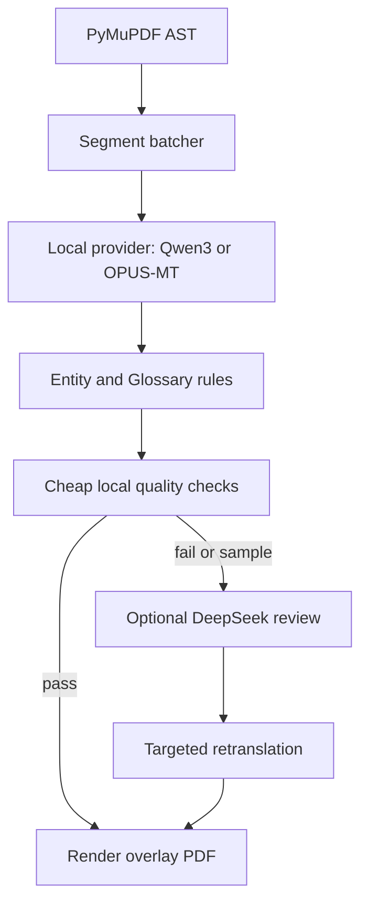

# 本地英文→中文翻译小模型调研

- **Research Date:** 2026-09-01
- **Confidence Level:** 中高；仓库元数据为高置信，具体译文质量和资源占用需本机基准测试
- **Subject:** 面向本地 PDF 文学翻译的英文→简体中文模型与运行路线

## Executive Summary

对于当前项目，推荐先测试 **Qwen3 4B/8B Instruct + Ollama 或 llama.cpp**，再用 30 个合法 Golden Set 段落与 DeepSeek 做对照。Qwen3 官方仓库仍活跃，适合遵循人物名、Glossary、JSON 约束，但它是通用大语言模型，不是专用机器翻译模型[citation:Qwen3 GitHub](https://github.com/QwenLM/Qwen3)。

如果机器资源非常有限，**Helsinki-NLP OPUS-MT English→Chinese** 是更轻量的专用基线；它的官方项目是 MIT 许可的开源机器翻译模型与服务集合[citation:OPUS-MT GitHub](https://github.com/Helsinki-NLP/Opus-MT)。不过它对文学语气、人物一致性和项目要求的结构化 JSON 支持较弱，需要由项目代码负责术语和实体约束。

**NLLB-200** 和 **SeamlessM4T** 不建议作为 V1 的第一选择：前者适合多语种覆盖，后者还包含语音能力，部署更重；两者的模型许可和商用限制必须按具体模型卡核查。Fairseq 官方仓库已归档，不应把它作为新的运行时依赖[citation:Fairseq GitHub](https://github.com/facebookresearch/fairseq)。

## Candidate Comparison

| 方案 | 类型 | 本地资源 | 文学翻译潜力 | JSON/术语约束 | V1 建议 |
|---|---|---:|---:|---:|---|
| OPUS-MT en→zh | 专用 NMT | 低 | 中低 | 弱 | 作为低资源基线 |
| NLLB-200 distilled 600M | 多语种 NMT | 中 | 中 | 弱 | 作为质量对照 |
| Qwen3 4B/8B | 通用 LLM | 中 | 中高 | 强 | 首选试点 |
| SeamlessM4T | 多模态/多语种 | 高 | 中 | 中 | 不纳入 V1 |
| Fairseq | 推理/训练框架 | 不适用 | 取决于模型 | 取决于模型 | 不新增依赖 |

## Model Analysis

### OPUS-MT

OPUS-MT 由 Helsinki-NLP 维护，定位是开放神经机器翻译模型和 Web 服务[citation:OPUS-MT Repository](https://github.com/Helsinki-NLP/Opus-MT)。English→Chinese 模型可以作为速度和成本基线，适合短段落批量翻译。

限制：专用 NMT 通常不能可靠执行当前项目要求的 Entity observation、Glossary suggestion 和严格 JSON 输出。建议通过 Python 包装器返回普通译文，再由项目代码注入人物名、检查术语并生成统一的 `TranslationResult`。

### NLLB-200

NLLB 路线适合需要大量语言覆盖的场景，English→Chinese 质量通常优于非常小的通用模型，但 600M 级别仍需要比 OPUS-MT 更高的内存。应以具体 Hugging Face 模型卡的许可证为准，不要仅依据推理代码判断能否商用[citation:NLLB Model Card](https://huggingface.co/facebook/nllb-200-distilled-600M)。

### Qwen3

Qwen3 官方仓库提供从小尺寸到大尺寸的模型系列和本地部署说明[citation:Qwen3 Repository](https://github.com/QwenLM/Qwen3)。对本项目最有价值的是指令遵循能力：可以直接要求它保留段落结构、复用 canonical person name、应用用户 Glossary，并返回受约束的 JSON。

限制：Qwen3 不是专用翻译模型，长篇文学质量不能仅由参数量推断。必须测试引号、破折号、人物名、段落长度和上下文连贯性；建议默认关闭思考模式以减少延迟和输出 token。

### SeamlessM4T

Seamless Communication 的官方定位是语音和文本翻译基础模型[citation:Seamless Communication GitHub](https://github.com/facebookresearch/seamless_communication)。对于纯文本 PDF，它包含的语音能力是额外负担，部署复杂度和资源需求都高于当前 V1 所需，不建议优先引入。

### Fairseq

Fairseq 是序列到序列工具包，但 GitHub 官方仓库当前标记为 archived[citation:Fairseq GitHub](https://github.com/facebookresearch/fairseq)。因此不建议把它直接加入当前项目；只有在选择某个旧模型且没有更现代推理后端时，才考虑隔离使用。

## Recommended Architecture



不要把 Ollama、模型下载和翻译逻辑写进 Next.js。Python 层增加 `LocalTranslationProvider`，继续实现现有 `TranslationProvider` Protocol；Provider 工厂根据配置选择本地或 OpenAI-compatible endpoint。专用 NMT 与 LLM 都转换为相同的 `TranslationResult`，其缺失字段由代码填充为空列表。

建议配置：

```env
TRANSLATOR_PROVIDER=ollama
TRANSLATOR_BASE_URL=http://127.0.0.1:11434/v1
TRANSLATOR_MODEL=qwen3:8b
REVIEWER_ENABLED=false
```

## Benchmark Protocol

在决定模型前，使用 30 个拥有合法使用权的 Golden Set 段落，至少包含：普通叙事、对话、人物首次出现、重复人物名、Glossary 术语、跨页段落和短标题。

记录：

- 每段延迟和总吞吐量；
- 峰值 RAM/显存；
- 输入和输出 token（LLM 路线）；
- JSON 成功率；
- Entity 一致性；
- Glossary 命中率；
- 人工 Judge 的 fidelity、coherence、formatting 分数；
- 失败后重试比例。

建议淘汰条件：JSON 成功率低于 99%、人物名一致性低于 99%、出现截断、或 PDF 渲染失败率高于云端基线。

## Final Recommendation

1. 先实现可配置的 Provider 工厂，不改变现有 Workflow 和渲染器接口。
2. 用 OPUS-MT 做低资源速度基线。
3. 用 Qwen3 4B/8B 做文学质量基线；若本机资源允许，优先 8B。
4. 让高级云端模型只审核规则失败段落和 10%～20% 随机样本。
5. 只有 Golden Set 证明本地模型达到可接受质量后，才把它设为默认翻译器。

## Sources

- [citation:OPUS-MT GitHub](https://github.com/Helsinki-NLP/Opus-MT)
- [citation:Fairseq GitHub](https://github.com/facebookresearch/fairseq)
- [citation:Seamless Communication GitHub](https://github.com/facebookresearch/seamless_communication)
- [citation:Qwen3 GitHub](https://github.com/QwenLM/Qwen3)
- [citation:NLLB-200 distilled 600M Model Card](https://huggingface.co/facebook/nllb-200-distilled-600M)

## Confidence Assessment

- **High:** 仓库存在性、维护组织、GitHub archived 状态和公开许可证字段，均来自官方 GitHub API。
- **Medium:** 具体模型质量、内存需求和中文文学表现，必须在固定硬件、固定量化和 Golden Set 上实测。
- **Lower:** 未经本项目基准测试的成本节省比例，不作数值承诺。

## Methodology

本报告执行了官方 GitHub API 元数据核查，并结合官方仓库及模型卡链接进行候选筛选。候选按专用翻译能力、中文文学适应性、本地资源、结构化输出能力和许可证风险进行比较。由于当前 Windows 终端无法无损显示部分官方 README 的 Unicode 内容，未将 README 中未能完整读取的细节作为高置信结论。
